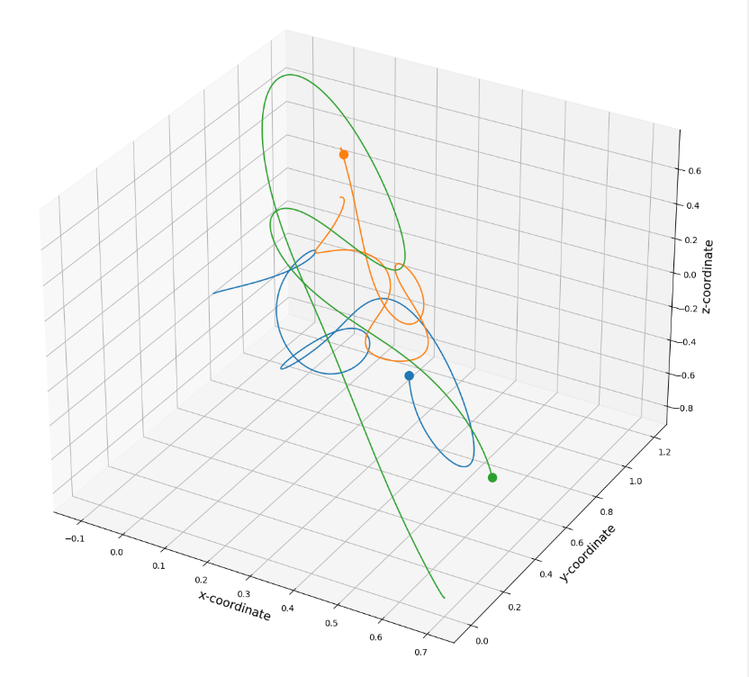

# CelestialMechanics

## Introduction

This project focuses on the topic of Celestial Mechanics, for which by definition is a branch of astronomy and physics that deals with the motion of celestial bodies such as planets, moons, stars, asteroids, and comets under the influence of gravitational forces. We research our topic based on our findings and how to apply with two different methods of **RK4** and **N-Body** simulations.

## Tech Stack
1. Visual Studio Code
2. Jupyter Notebook
3. Python (NumPy, Scipy.Constant, & Matplotlib)

## Features
Our Jupyter Notebook file contains a feature to display a 3D data visualization to show trajectory of number of masses interacting each other due to gravitational force.

## Process
This project was completed as a group for our final semester project of MCS-355 Scientific Computing from Gustavus Adolphus College. Our sources was limited such that we do not use online sources, and our professor wanted our class to use primary sources from our college library. As we start our project, we take notes from our primary sources and try compute our findings in Python, such as *Symplectic Integrator* to have our mass update its velocity from its previous velocity. Yet, we had a project from another course, MCS-178 Introduction to Computer Science II, that we worked on called **N-Body Simulation** which was done in Java. Our professor gave us permission to use our previous project to compare to **RK4** method. We tested our two methods by displaying data visualization to see how object interact each other. Our results were almost identical to each other, so there is not much of a difference. There were some complications with our project was trying to formulate **RK4** method in Python because our primary source was not well explained, and we had animated data visualization, but it was done in Google Colab and transfering the Jupyter Notebook file to Visual Studio Code does not allow to be imported, so the current file in the repository only display a figure.

## Learning
What I learn from this project was the understanding the method of **RK4** and how it compares to **N-Body** method. Understanding how number masses interact each other due to gravitational force.

## Improvments
Our research needs improvment on documenting our research, and explain what RK4 method is and how it works. 

## Running the Projects
If you want to try running or modifying our research project, feel free to download the **celestial_mechanics.ipynb** file and run it either on Visual Studio Code (make sure to install Jupyter Notebook extension), Jupyter Notebook, and Google Colab.

